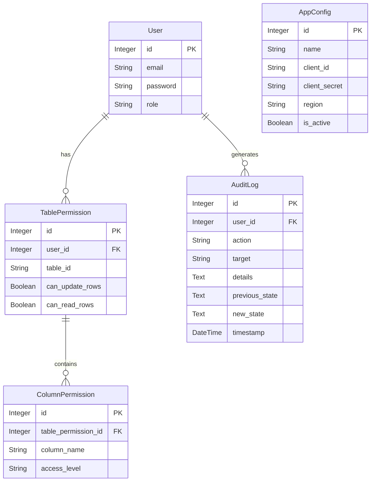

# Genesys Cloud Data Table Manager

This is a simple tool I built to help manage Genesys Cloud Data Tables. It makes it easier to edit rows, manage who can see or change what, and keep track of changes.

## What it does

*   **Manage Users**: You can create users and give them Admin or User roles.
*   **Permissions**: You can decide exactly which tables or columns a user can read or write.
*   **Edit Data**: Add, update, or delete rows in your Data Tables easily.
*   **Search**: Quickly find the data you need.
*   **Backup**: Save your tables to a JSON file and restore them later if needed.
*   **Environments**: Switch between different Genesys organizations (like Dev, Test, Prod) without restarting.
*   **Audit Logs**: Keeps a history of who changed what.

## How to run it

### The easy way (Windows)
Just double-click the **`run.bat`** file.
It will set everything up for you (install libraries, etc.) and open the app in your browser.

### The manual way
If you prefer the command line:
1.  Install the requirements:
    ```bash
    pip install -r requirements.txt
    ```
2.  Run the app:
    ```bash
    python app.py
    ```
3.  Open your browser to `http://127.0.0.1:5000`.

## First Login

When you run it for the first time, use these credentials:
*   **Email**: `admin@admin.com`
*   **Password**: `panama123`

After you log in, the app will ask you to set up your Genesys Cloud connection. You'll need your **Client ID** and **Client Secret** ready. Just add a new environment (e.g., "Production") and click **Activate**.

## Notes

*   The app uses a local database file (`genesys_manager.db`) to store users and settings.
*   If you use this in a real production environment, make sure to change the secret key in the code.

Enjoy!

## Database Schema


