# Genesys Cloud Data Table Manager

This is a simple tool I built to help manage Genesys Cloud Data Tables. It makes it easier to edit rows, manage who can see or change what, and keep track of changes.

## What it does

*   **Manage Users**: You can create users and give them Admin or User roles.
*   **Permissions**: You can decide exactly which tables or columns a user can read or write.
*   **Edit Data**: Add, update, or delete rows in your Data Tables easily.
*   **Search**: Quickly find the data you need.
*   **Backup**: Save your tables to a JSON file and restore them later if needed.
*   **Environments**: Switch between different Genesys organizations (like Dev, Test, Prod) without restarting.
*   **Audit Logs**: Keeps a history of who changed what.
*   **Rollback Functionality**: Functionality to Undo the changes.


## Business Process Overview

This workflow demonstrates how the application bridges the gap between Business Users and Genesys Cloud, ensuring security and compliance.

```mermaid
graph TD
    %% Actors
    Admin[👤 Administrator]
    BizUser[👤 Business User]

    %% The Application Boundary
    subgraph Solution [🛡️ Data Manager Solution]
        direction TB
        Rules[📋 Security Rules]
        Dashboard[💻 Simplified Dashboard]
        Compliance[✅ Audit & Compliance Log]
    end

    %% External System
    Genesys[☁️ Genesys Cloud]

    %% Relationships
    Admin -->|1. Configures Access| Rules
    Rules -->|Enforces| Dashboard
    
    BizUser -->|2. Views & Edits| Dashboard
    Dashboard -->|3. Secure Update| Genesys
    Dashboard -.->|4. Auto-Logging| Compliance
```



## How to run it

### Windows
Just double-click the **`run.bat`** file.
*   It will create a central environment in `C:\PilviContactCenter`.
*   It will install all necessary libraries.
*   It will open the app in your default browser automatically.

### macOS / Linux
1.  Open your terminal.
2.  Make the script executable (first time only):
    ```bash
    chmod +x run.sh
    ```
3.  Run the script:
    ```bash
    ./run.sh
    ```
*   It will create a central environment in `~/PilviContactCenter`.
*   It will install all necessary libraries.
*   It will open the app in your default browser automatically.

### The manual way
If you prefer the command line:
1.  Install the requirements:
    ```bash
    pip install -r requirements.txt
    ```
2.  Run the app:
    ```bash
    python app.py
    ```
3.  Open your browser to `http://127.0.0.1:5000`.

## First Run & Setup

Since version 2.0, the application includes a **Setup Wizard** for the initial configuration. You no longer need to use default credentials.

1.  **Launch the App**: Run `run.bat` (Windows) or `./run.sh` (Mac/Linux).
2.  **Create Admin User**: On the first run, you will be prompted to create your **Administrator Account** (Email & Password).
3.  **Connect Genesys Cloud**: You can optionally enter your Genesys Cloud Client ID, Client Secret, and Region during setup, or configure it later in the Admin Panel.

Once setup is complete, simply log in with the credentials you just created.

## Utility Scripts

The project includes several utility scripts for debugging and inspection (e.g., `inspect_row.py`, `check_schema.py`).
These scripts have been updated to be interactive. When you run them, they will prompt you to enter the **Table ID** you wish to inspect, making them safe and easy to use across different organizations.

## Notes

*   The app uses a local database file (`genesys_manager.db`) to store users and settings.
*   If you use this in a real production environment, make sure to change the secret key in the code.

Enjoy!

## Database Schema


## System Architecture & Security

This diagram illustrates the local nature of the application and the libraries used to ensure security and functionality.

```mermaid
graph TD
    subgraph Local_Machine ["💻 Local Machine (Secure Boundary)"]
        
        User[("👤 User (Browser)")]
        
        subgraph Application ["🚀 Flask Application"]
            
            WebApp["app.py (Controller)"]
            Auth["🔐 Security Layer<br/>(CSRF, Password Hash)"]
            Logic["⚙️ Business Logic<br/>(Pandas, Data Processing)"]
            
            WebApp <--> Auth
            WebApp <--> Logic
        end
        
        subgraph Storage ["💾 Local Storage"]
            DB[("🗄️ SQLite Database<br/>(genesys_manager.db)")]
            Config["📄 .env / Config"]
        end
        
        User <-->|"HTTP (Localhost)"| WebApp
        Logic <-->|SQLAlchemy| DB
        WebApp -.->|Reads| Config
    end
    
    subgraph External_Cloud ["☁️ Genesys Cloud"]
        GC_API["📡 Genesys Cloud API"]
    end
    
    Logic <-->|"HTTPS (Secure)"| GC_API
    
    note_libs["📚 Key Libraries:<br/>- Flask<br/>- Pandas<br/>- SQLAlchemy<br/>- PureCloudPlatformClientV2"]
    style note_libs stroke-dasharray: 5 5
    
    Application -.- note_libs
```


